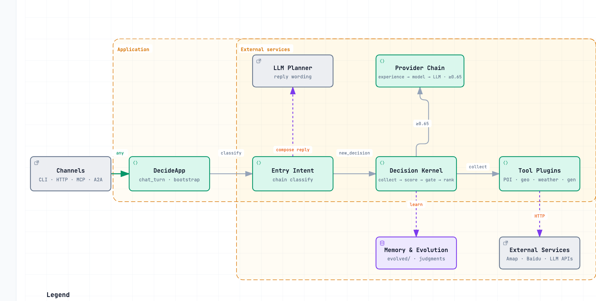
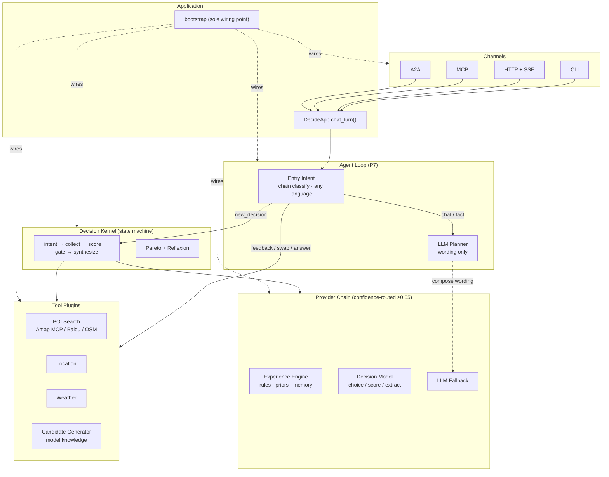
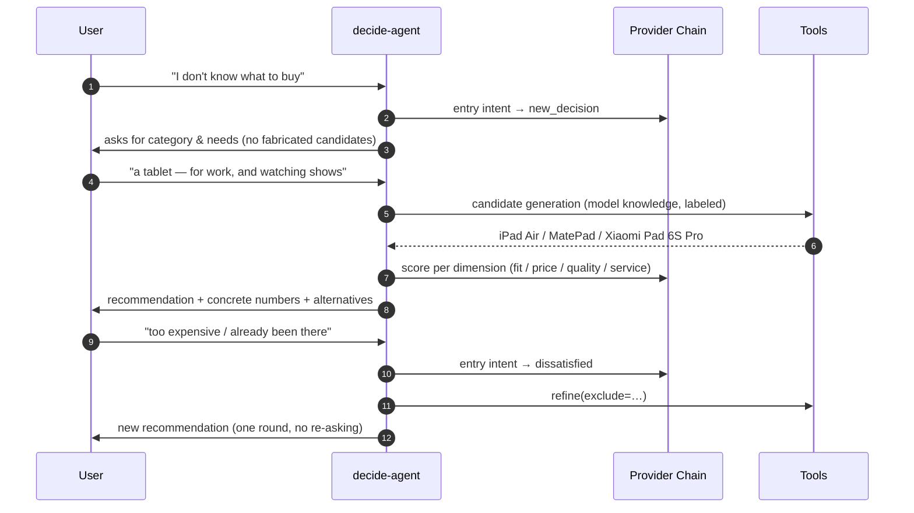

<div align="center">

# decide-agent

**A decision-intelligence agent for the chronically indecisive.**

Describe what you're struggling to choose — the agent clarifies, gathers real-world data, scores the options, and tells you *what* and *why*, with numbers.

[中文说明（见下方）](#中文说明) · [Contributing](CONTRIBUTING.md) · [Architecture](ARCHITECTURE.md)



</div>

---

## Why

Most LLM assistants answer "what should I buy?" with vague prose. **decide-agent** treats every choice as a small, auditable pipeline:

1. **Understand** — an LLM classifies your intent (new decision / feedback on a recommendation / follow-up answer / chit-chat) in any language
2. **Gather** — tool plugins fetch *real* candidates (nearby restaurants via Amap, weather via Open-Meteo, products generated from model knowledge when no data source exists)
3. **Score** — every candidate is graded per-dimension (match / price / quality / …), weights live in config, not prompts
4. **Recommend** — Pareto filtering removes dominated options; the agent explains the winner *with numbers* (distance in meters, price in ¥) and honestly says when data is missing

It remembers your preferences, learns from feedback, and degrades gracefully: no API keys at all → it still works offline on rules alone.

## Features

- 🗣️ **Agentic dialogue** — intent is classified by the provider chain (decision model first, LLM fallback), in any language; the agent decides whether to ask, recommend, swap, or refine
- 🌐 **Real data sources** — pluggable vendor chain for POI search (Amap MCP / Baidu REST / Foursquare / OSM), location (multi-source IP geo), weather, routing
- 🧠 **Dynamic rubrics** — template-less decisions get dimensions *inferred from context* (choosing a gift has no price dimension; buying a laptop does)
- ⚖️ **Deterministic scoring core** — weighted synthesis, Pareto frontier, flip detection; pure code, fully auditable, works with zero models
- 📈 **Experience engine as advisor** — keyword priors, rule baselines and memory recall are *materials for the agent*, not gates; every judgment is logged for self-evolution
- 🔌 **Four surfaces, one kernel** — CLI, HTTP+SSE, MCP (Claude/Cursor-ready), A2A
- 🛡️ **Graceful degradation** — planner down → state-machine pipeline; vendors down → mock sources; models down → rules-only. Never crashes on missing data.

## Architecture



## Conversation Flow



> The production CLI replies in Chinese; diagrams use English labels for readability.
> 中文对话示例见下方「中文说明」。

## Quick Start

```bash
git clone https://github.com/<you>/decide-agent.git
cd decide-agent
uv sync

# generate config template + .env skeleton
uv run decide-agent init

# chat (LLM configured via .env → Agent Loop; no keys → offline rule pipeline)
uv run decide-agent chat
```

### Minimal configuration

`decide-agent init` writes `~/.config/decide-agent/config.jsonc` and a `.env` skeleton. Fill in what you have — everything degrades independently:

```bash
# .env — every key is optional
LLM_API_KEY=...        # enables the Agent Loop & semantic scoring
AMAP_KEY=...           # enables real POI search (vendor chain: Amap → Baidu)
```

| Config | Default | Meaning |
|--------|---------|---------|
| `llm.base_url` / `model` / `api_key_env` | — | powers the dialogue planner & semantic scoring |
| `decision_model.endpoint` | — | your own decision model (OpenAI-compatible primitive API) |
| `tools.region` | `cn` | vendor chain: `cn` → Amap→Baidu, `global` → Google→Foursquare |
| `llm.discover_opencode` | `false` | opt-in reuse of local opencode LLM credentials |
| `decision.confidence_threshold` | `0.65` | below → the agent asks instead of guessing |

### Example session

```text
你: 周末去哪玩
Decide-Agent: 你偏好哪种玩法？
  1. 自然   2. 人文   3. 亲子   4. 都行
你: 自然
Decide-Agent: 推荐环城公园-西山景区（综合 0.76）
  距离约 2.9 公里；备选逍遥津公园（372 米）…
你: 这个我去过了
Decide-Agent: （重新推荐：逍遥津公园 — 一轮直通，不重复追问）
```

## Other surfaces

```bash
uv run decide-agent serve-mcp --transport=stdio   # Claude / Cursor / opencode
uv run decide-agent serve-http --port 8000        # HTTP + SSE (auth-optional)
uv run decide-agent serve-a2a --port 8100         # A2A protocol
uv run decide-agent demo                          # scripted e2e, zero-config
uv run decide-agent tools                         # list discovered capabilities
```

## Extending

| Want to add | How | Code needed |
|-------------|-----|-------------|
| A decision scene (e.g. `laptop`) | drop `skills/<scene>/dimensions.jsonc` + rules + prompts | **none** — data only |
| A data source (e.g. e-commerce) | drop `plugins/tools/<name>/{tool.jsonc, impl.py}` | one small file |
| A vendor for POI search | implement one class in `models/providers/poi_sources.py` | ~40 lines |
| Another LLM | point `llm.base_url` at any OpenAI-compatible endpoint | **none** |

Details: [ARCHITECTURE.md](ARCHITECTURE.md) · [docs/CONFIG.md](docs/CONFIG.md) · [CONTRIBUTING.md](CONTRIBUTING.md)

## How it stays honest

- Recommendations **cite numbers** from tool results; when a fact is missing the agent says so instead of fabricating
- Dimensions/weights live in **config & templates**, never in prompts (auditable)
- Model-generated candidates are **labeled** as model knowledge
- Unanswered intents are logged (`intent_misses.jsonl`) to drive future scene templates

## Testing

```bash
uv run pytest                          # 262 tests: unit + integration + e2e
uv run lint-imports                    # architecture layering contract (CI gate)
uv run ruff check .                    # style
uv run python tests/live_matrix.py     # live LLM conversation matrix (12 archetypes)
```

## License

Apache-2.0 — see [LICENSE](LICENSE).

---

# 中文说明

**decide-agent** 是一个面向“选择困难症”的决策智能体：你说不清要什么没关系——它会澄清意图、抓取真实数据（附近地点/天气/商品候选）、逐维度打分，并**带具体数值**地告诉你推荐什么、为什么。

## 核心特性

- **Agent 对话**：意图由链上模型语义判定（决策模型优先、LLM 兜底），任意语言；追问/推荐/换备选/负反馈全部一轮直通
- **真实数据源**：POI 搜索厂商链（高德 MCP → 百度 REST → OSM）、多源 IP 定位、天气、路由——均为可插拔插件
- **动态评估维度**：无模板的决策由模型按语境推断维度与权重（送书没有价格维度、买平板有质感维度）
- **确定性打分核心**：加权合成 + 帕累托前沿 + 翻车检测，纯代码可审计，零模型也能跑（规则兜底）
- **经验引擎 = 参谋**：关键词先验、规则基线、记忆召回作为 Agent 的辅助判断材料；每次判断落盘，支撑自进化
- **四通道一内核**：CLI / HTTP+SSE / MCP / A2A
- **优雅降级**：规划器挂 → 状态机管道；厂商挂 → mock；模型挂 → 纯规则。缺数据永不崩溃

## 架构与流程

见上方 Mermaid 图：**通道 → 应用入口 → 意图判定（链上语义）→ 机械分派工具 → 决策内核（收集→打分→门控→合成）**。三层判断链（经验引擎 → 决策模型 → LLM）按置信度 0.65 路由，任一级达标即定案，失败自动降级。

## 快速开始

```bash
uv sync
uv run decide-agent init     # 生成 ~/.config/decide-agent/config.jsonc + .env 模板
uv run decide-agent chat
```

配置好 `LLM_API_KEY` 即启用 Agent 对话；什么 key 都不配也能用（离线规则管道）。

## 配置速查

| 配置 | 默认 | 说明 |
|------|------|------|
| `llm.base_url/model/api_key_env` | — | 对话规划器 + 语义打分 |
| `decision_model.endpoint` | — | 自有决策模型（OpenAI 兼容原语 API） |
| `tools.region` | `cn` | `cn` → 高德→百度；`global` → Google→Foursquare |
| `decision.confidence_threshold` | `0.65` | 低于则追问而非硬猜 |

## 扩展

- **加决策场景**：`skills/<场景>/` 放五个 jsonc 模板，零代码
- **加数据源**：`plugins/tools/<名字>/` 一个 manifest + 一个 impl.py
- **加厂商**：`models/providers/poi_sources.py` 一个类 ~40 行

## 测试

```bash
uv run pytest                      # 262 用例
uv run lint-imports                # 架构分层契约
uv run python tests/live_matrix.py # 真实 LLM 全场景对抗矩阵
```

## 参与贡献

见 [CONTRIBUTING.md](CONTRIBUTING.md)。License：[Apache-2.0](LICENSE)。
